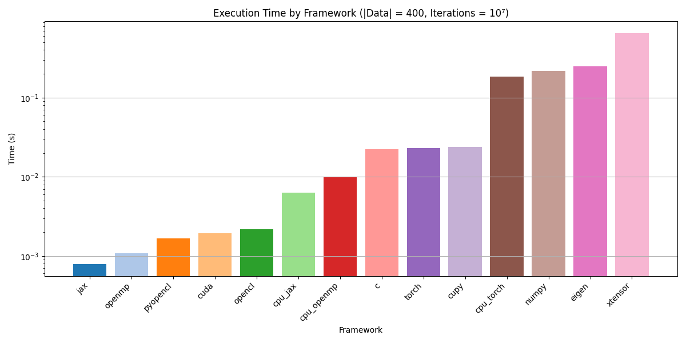

# Cubic Interpolation

Welcome! The purpose of this repository is to test porting various parallel, GPU, and other computing frameworks to a portion of code performing a cubic interpolation within BAYESTAR, a sky localization algorithm.

We've tested the following frameworks thus far:
- c_test: pure C, OpenMP, OpenCL, and CUDA
- cpp_test: xtensor and Eigen
- python_test: NumPy, CuPy, JAX, PyOpenCL, and PyTorch

Current areas for improvement include using JIT compilation for the PyTorch benchmarks and implementing custom kernels for CuPy.

